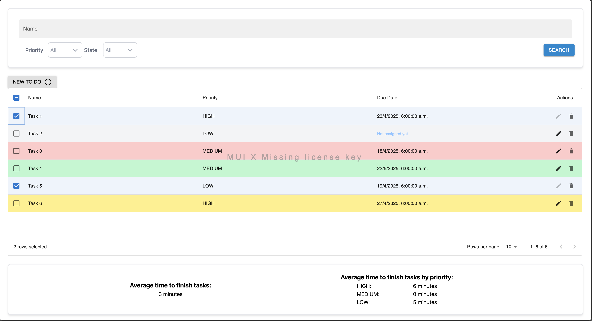

# ToDo-project

A clean and functional To Do app that helps users manage their tasks with ease and clarity.
This project showcases an minimalist UI using MUI, practical filtering and sorting.

## Features

- **Add / Delete / Mark tasks** as done or undone
- **Bulk complete or incomplete** all tasks on a single page
- **Filter by** task name (even partial matches), priority, or status
- **Sort by** due date and/or priority (via MUI's Data Grid Pro and handled on the backend)
- **Pagination** for better usability with large task lists (handled on the backend)
- **Task metrics** in the footer:
  - Average completion time per priority
  - Overall average completion time

## Tech Stack

### Frontend

- **Node.js v21**
- **React** with **TypeScript**
- **Material UI (MUI)** components — including **Data Grid Pro** (trial usage)

---

#### More info can be found in its own README file

---

### Backend

- **Java 21**
- **Spring Boot**
- **Lombok** for boilerplate reduction
- In-memory storage with **HashMap** (database-ready structure)

---

#### More info can be found in its own README file

---

## Installation

Clone the repository:

```bash
git clone https://github.com/LuisGutierrez15/ToDo-project
```

Install frontend dependencies:

```bash
cd to_do_frontend
npm install
```

### Running the App

- Start the **backend** (runs on port `9090`)

```bash
cd to_do_backend
mvn spring-boot:run
```

- Start the **frontend** (runs on port `8080`)

```bash
cd to_do_frontend
npm run start
```

### Running tests

- **Backend** (on backend directory)

```bash
mvn test
```

- **Frontend** (on frontend directory)

```bash
npm run tests
```

## Screenshot



## License

This project is for learning and testing purposes. No license has been applied yet. Use at your own discretion

## Credits

Developed by **Luis Angel Gutierrez Pineda**  
With mentoring and guidance (e.g., MUI integration, debugging and design patterns)
Mentor: **Bernardo Escoffie Torre**
